## Hi there！ It's Bruce
## Here is my Lab report for week 1：

# 1. How to install VScode:
- Go to the official website https://code.visualstudio.com/ and download versions that fit for your computer (e.g windows or Macs).
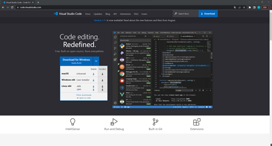

- Then follow the instructions on the website to install. When you finished, you should be able to see this:
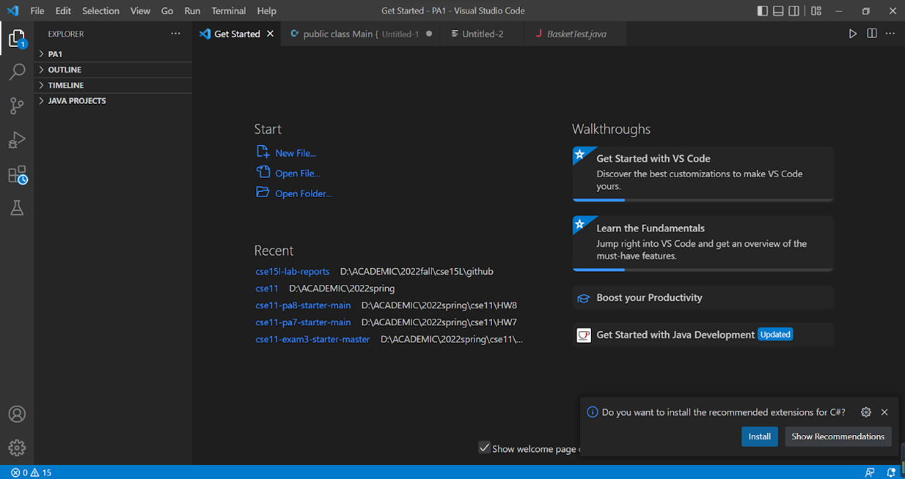

# 2. How to connect remotely
- First step is to make sure OpenSSH is installed on your computer
    - If you are in windows: go to settings/applications/optional features, and then check the OpenSSH open to see if it is installed, if not install it.
- Second step is to use $ ssh command to help us to connect with the server.
    - The code looks like this: 
    
        $ ssh cs15lfa22zz@ieng6.ucsd.edu 
    
        (with the last two digits zz replaced with your own account)
    - Then typed in the password, and you should be able to see something like this:

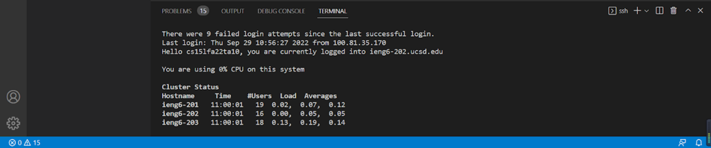

# 3. You are now in the server!
- Now you can try some commands in the server such as “ls” to look what files it has in the directory.
    - i.	cd commands to go in and out the directories.
    - ii.	cat to print the content of a file, etc.
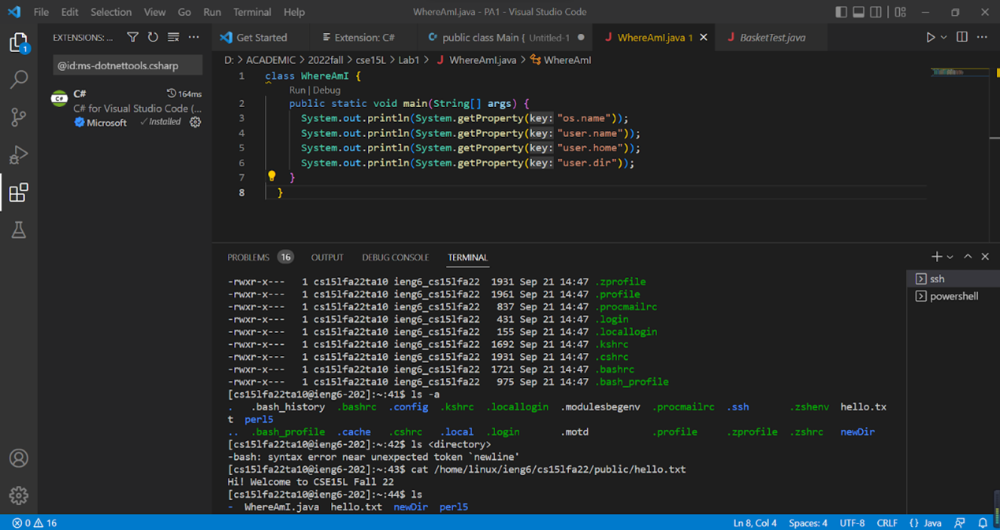

# 4. Moving files with *scp*.
- a)	The *scp* commands, we are able to copy our files in our local computer up to the server so that we can access the file at the server!
- b)	Here is how it works:
    - scp WhereAmI.java cs15lfa22zz@ieng6.ucsd.edu:~/
    - scp filename.java YourAcountNumber@ieng6.ucsd.edu

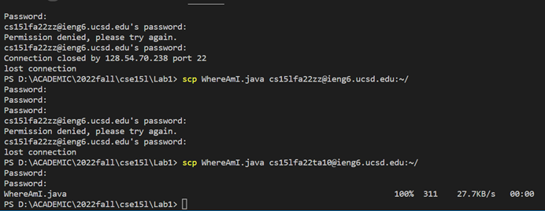

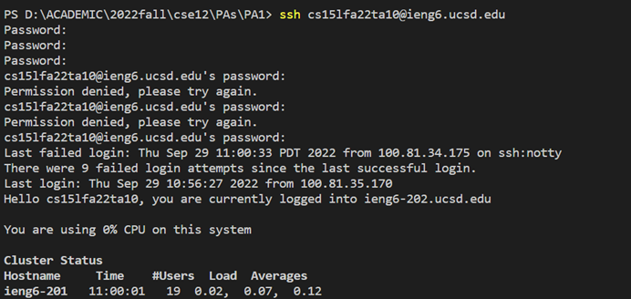

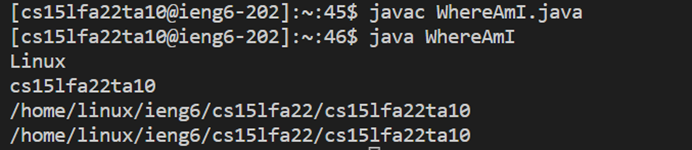
- You will notice that the same program WhereAmI.java act differently at your local lever and on a server. That is because your local computer and the computer supporting the server are different.

# 5. SSH Keys!
- It is annoying that every time we try to log in, the server asks us for the password. Sometimes it is just not convenient since we may go back and forth between the local and the server.

- a)	Thus, we need to create a SSH Keys
    - i.	First step is to type the command line

$ ssh-keygen

    - $ ssh-keygen will help to generate a public and a private key for us, so they could use the public key and keep it at some specific directory that the server could identify us without asking us to enter the password.

    - Here is how we could do it on windows:

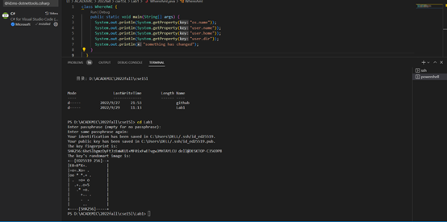

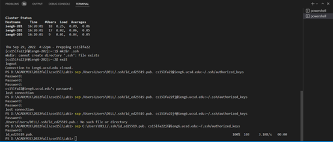

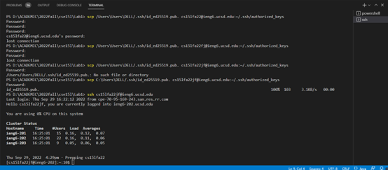

- Now, we don’t have to type in our password when we are working with ssh and scp. Awsome!

# 6. It can be more convenient!
- a)	We could use ssh for only one line of command to run the program at the server and logout
- i.	The code looks like this 

$ ssh cs15lfa22@ieng6.ucsd.edu "ls"

- ii.	It looks like this:

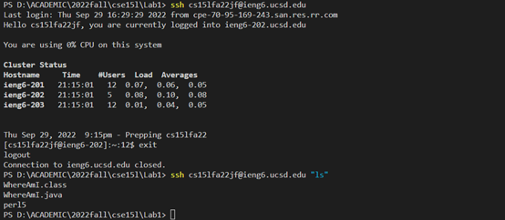

- Now, we could run our code directly on the server within just one line of code via ssh.
