## Hi there！ It's Bruce
## Here is my Lab report for week 3：

# Part 1.
-Simplest Search Engine!!
-Implementing a web server, we can now play with the urls.
  here is what I did
  
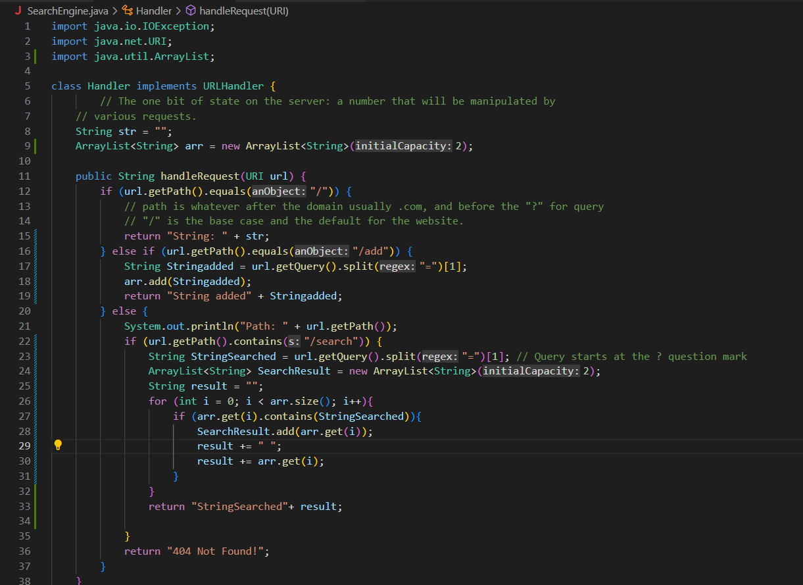

Which methods in your code are called
What the values of the relevant arguments to those methods are, and the values of any relevant fields of the class
If those values change, how they change by the time the request is done processing

-Through these changes, I am now able to interact with the web server through urls. 
  Add strings and search strings or part of a string.
  
-Thats awsome, here are some screenshots when it is running.
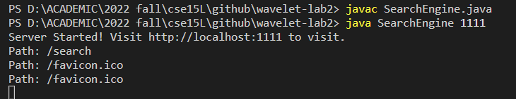

-First we created the web server via java

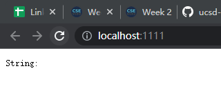

-Trying "/", the default status
handleRequest method was called
path only contains "/"; 
Thus return "String" + str(where it is empty);

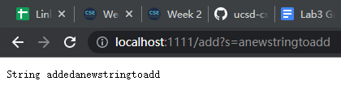

-Tyring "add"
handleRequest method was called
path now contains add and takes the query as "=addnewstring" after the "?"; 
Thus return "String added" + Stringadded('addnewstring' in this case);
added into a Arraylist to store the string value. For latter search purposes.

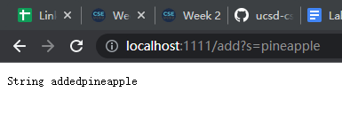

-Try it again
handleRequest method was called
path now contains add and takes the query as "=apple" after the "?"; 
Thus return "String added" + Stringadded('apple' in this case);
added into a Arraylist to store the string value. For latter search purposes.

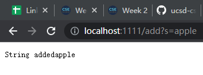

-Tyring "search"
handleRequest method was called
into the if condition that path contains "search"
It will go though the Arraylist that contains strings added,
thus search and return whatever contains any fragment of the coe in the path.
- Yeah, we now searched for app, and pineapple and apple showed up.

# Part2
-Array Methods!!
-For ArrayTests
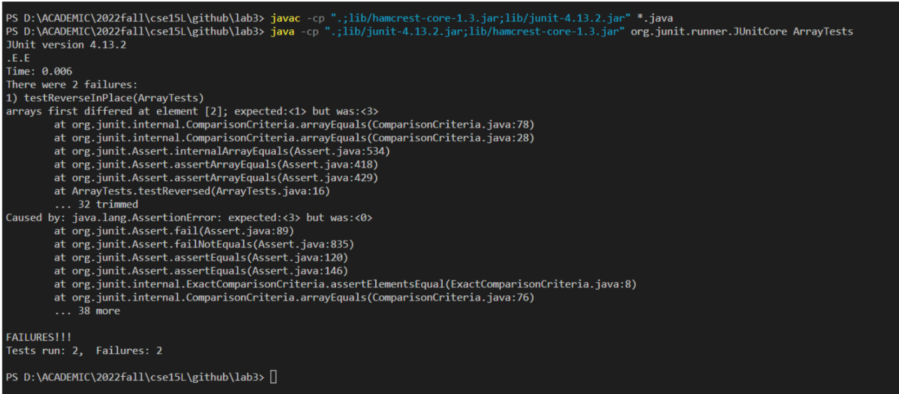

  -Failures!!!
-There are some thing going wrong obviously according to its symptomps.

  -For both reversed methods, ‘reverseInPlace’ and ‘reversed’, they fail to perform the intended output of changing the input integer array to the reversed order.
  -Since it did not make a copy of the original input array and directly adjust the elements in the input array, 
  -resulting in the arr[i] changing to its mirrored position in the array.
  -It would work for the first half of the array but after processing the first half, it cannot retrieve the original data for the latter half and copy them to the       -first half of the array. Thus we will have a mirrored array instead of a reversed array.
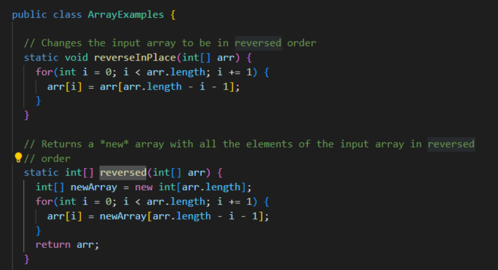

-It has the buggy code here:
At the arr[i] = newArray[arr.length - i - 1];
arr[i] = arr[arr.length - i - 1] 

-How to fix it?
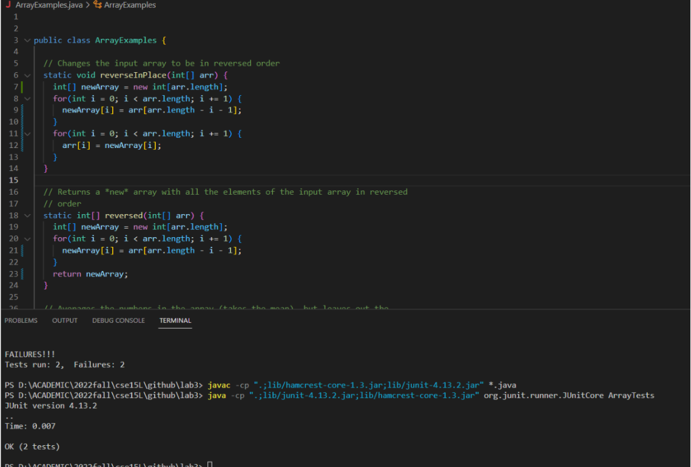

By doing the changes in the screen shot, to have a newArray to store the reversed value and change the value back at arr Array. 
This problem will be solved.

-List Methods!!
-For ListTest
  -To test it we get
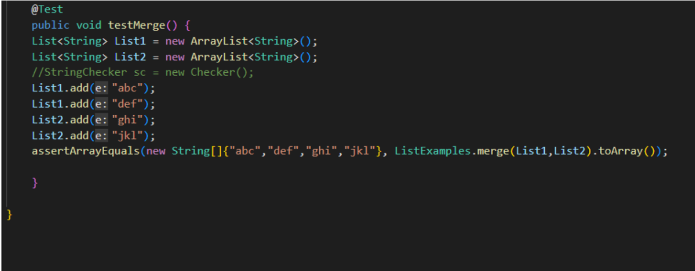

  -Also Failures!!!
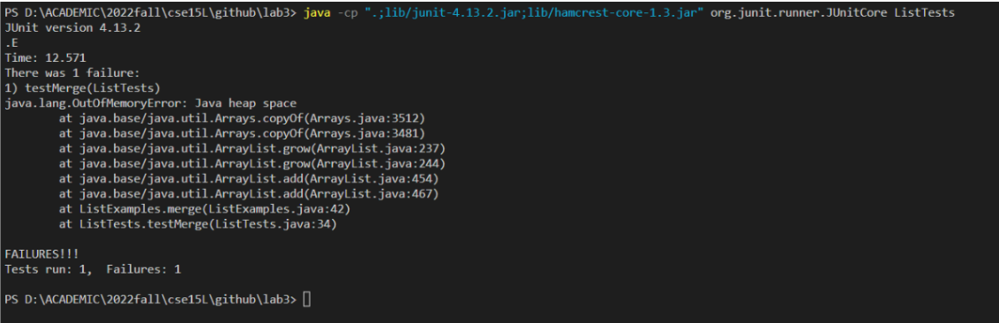

-Why?
Here is the bug:
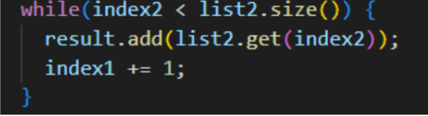

The problem is the incrementing index is index1 instead of index2, thus causing an infinite while loop that causes ‘OutOfMemoryError’.
