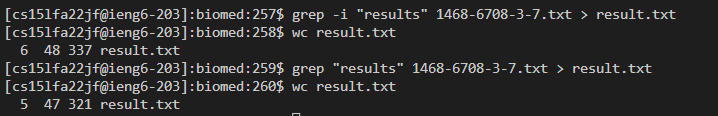
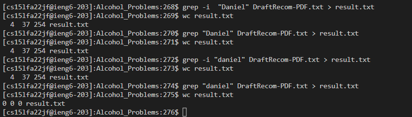
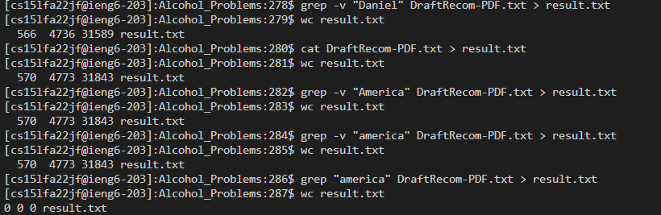
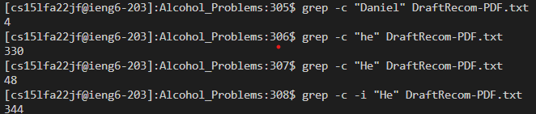
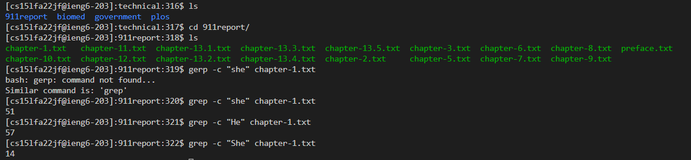

## Hi there！ It's Bruce
## Here is my Lab report for week 5：

# More Less Commands!
- Here are some 'less' commands that we could use to make our life easier.

```
  - less -N filename
```

  - 

  - -N command can help to shows line numbers.


```
  - less -X filename
```
  - 
  - 

  - By default, when we use less, the file contents will be cleared from the screen.
  - The -X command helps to leave file contents on screen so that we can keep looking the results in the terminal.

```
  - less +F filename
```
  - 
  - 
  
  - The +F option tells less to watch the file contents for changes. This is useful when opening log files.

# More Find Commands!

```
  find -D help
```
  - This command is very useful to diagnose problems with why find is not doing what you want.
  - 

```
  find . -type f
```
  - This command helps to find type f of files in the provided directory
  - f means normal files like .txt
  - It works like this
  - 

```
  find . -type f
```
  - This command helps to find type f of files in the provided directory
  - It works like this
  - 

# More Greb Commands!
# Here Here Here, I made changes here
# for 3 grep commands each with 3 examples!!!

```
  grep -i "String" file
```
  - This command helps to ignore uppercase vs. lowercase; it's helpful when you do not want to care about lower and upper cases.
  - It works like this
  - 

  - You see the american is not uppercased but there are still 81 results
  - and without -i it matches 0

  - more examples!
  - 

  - You see there is one more "result" got searched because of -i command that ignore the lower/upper case

  - more examples!
  - 

  - You see this "Daniel" example, it clearly shows that they are 4 Daniels in the txt. Since it is a person's
  - name, it can not be lower case really. Thus, grep "daniel" will have no matching results. However with -i
  - it have 4 results, same as using grep "Daniel"


```
  grep -v "String" file
```
  - This command helps to searched the reservsed, inverted match of results.
  - 

  - Since we have seen that "grep -i 'american'" yields no match, if we invert the search with -v command
  - it will correspond to all the lines in the file, which is 731 lines.

  - more examples!!
  - 

  - As we have previously, there are 4 matching "Daniel" in the txt, and -v does the inverse search
  - And I am showing that there are only 570 lines with cat.
  - Also I tried for "America" and "america", and seems there are no results.

```
  grep -c "String" file
```
  - This command helps to suppress normal output; instead print a count of matching lines for each input file.
  - 'c' stands for count!!!
  - Just like the opposite of -v, counting the matching line
  - Here is how it works
  - 

  - 
  
  - Yes, it is the opposite of -v, -c only counts for the lines
  - It is really interesting that when I use -i to ignore the lower/upper case of words
  - it pops up 344 matchs.

  - 

  - Another example, -c only gives the number of lines that grep found matched.
  - It stands for count!!!

