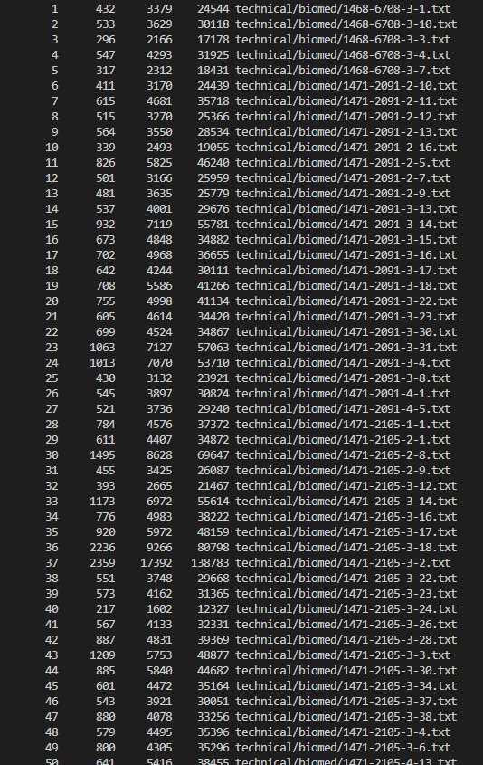
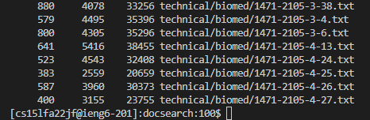
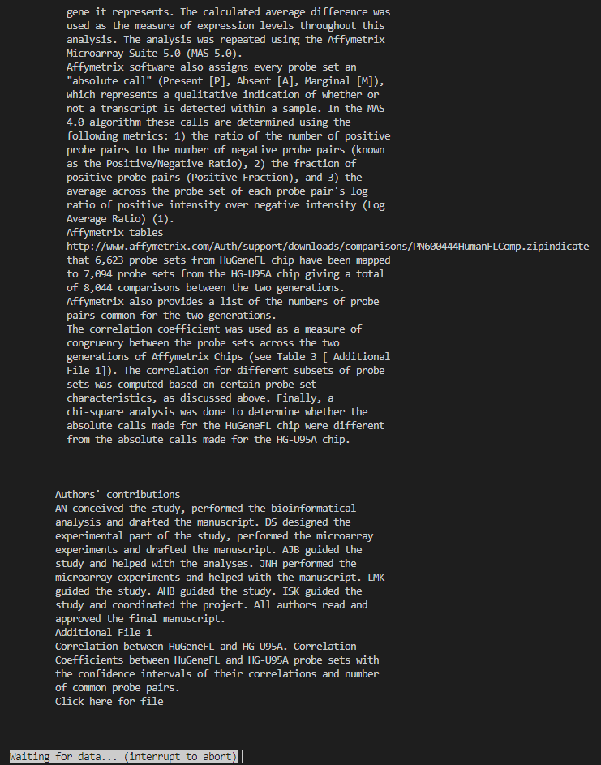
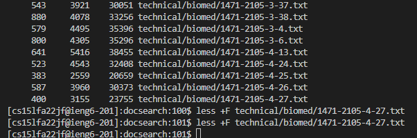
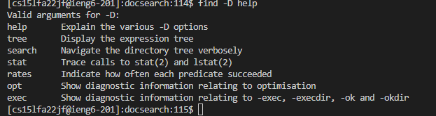
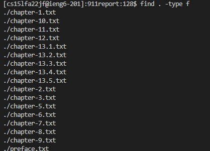
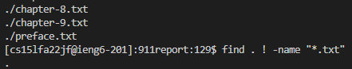

## Hi there！ It's Bruce
## Here is my Lab report for week 5：

# More Less Commands!
- Here are some 'less' commands that we could use to make our life easier.

```
  - less -N filename
```

  - 

  - -N command helped to shows line numbers.


```
  - less -X filename
```
  - 
  - 

  - By default, when less exits, the file contents will be cleared from the screen.
  - The -X command helps to leave file contents on screen

```
  - less +F filename
```
  - 
  - 
  
  - The +F option tells less to watch the file contents for changes. This is useful when opening log files.

# More Find Commands!

```
  find -D help
```
  - This command is very useful to diagnose problems with why find is not doing what you want.
  - 

```
  find . -type f
```
  - This command helps to find type f of files in the provided directory
  - f means normal files like .txt
  - It works like this
  - 

```
  find . -type f
```
  - This command helps to find type f of files in the provided directory
  - It works like this
  - 

# More Greb Commands!

```
  grep . -type f
```
  - This command helps to find type f of files in the provided directory
  - It works like this
  - 
