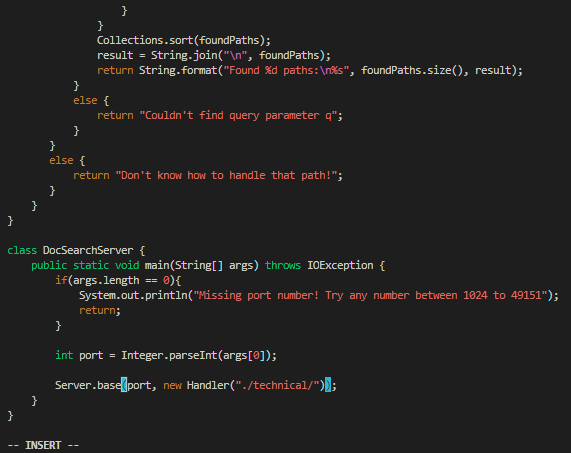

## Hi there！ It's Bruce
## Here is my Lab report for week 7：

# Part 1!!

```
  Changing the name of the start parameter and its uses to base
```

```
  All steps:
  1. /start<Enter>
  2. N
  3. dw
  4. i
  5. base
  6. <ESC>
  7. N
  8. dw
  9. i
  10.base
  11.<ESC>
  12.N
  13.dw
  14.i
  15.base
  16.<ESC>
  17.:wq
```


- use /search to look for "start"


- Press "Enter" to search for start 


- Press N key to the first(or later searched "start")


- Use dw key to delete the word start


- Press i to get into INSERT mode and type "base"


- Press "ESC" to get out of INSERT mode, so we can do the next change


- Keep pressing N to the next "start"


- Redo the step of dw to delete the word and use i to get into insert mode to add "base"
- then use "ESC" to get out


- Similar step to the last "start"


- Type :wq to same the changes done in the file and quit to get out.

- I realized when I am working on Part2, change the last start will cause some error
- meaning I should not change the last start since it seems it is not the getFile stuff

# Part 2!!
## Time myself with two different approches
- I used around 51 seconds to finish the task using the first approch
- While I spent around 60 seconds to do with the second approch

- For both task I change the same material and run bash test.sh accordingly.

- For changing at local and scp to the remote and log in to run it seems more intuitive and easy for me
- The good thing is that it is easier to grab my mouse around and just replace things.
- Though I have scp command I can copy, it is still not that convienent to type scp I think.
- If their some file with the same name, it is hard to scp.
- After scp, I still have to log in the ieng6 via ssh to run it remotely, that takes some extra time.

- For directly log in with ssh and use vim remotely
- The good thing is that I am already on the server and it is very clear to see all the files and everything
- The disadvantage is just using vim will be slightly slower compared with mouse.
- Overall I did not see significant difference using these two approch in time difference.


## Which of these two styles would you prefer using if you had to work on a program that you were running remotely, and why?
- If I can not run and test things on my own computer, if possible to the extend of program running complexity and operation system, 
- I think I will use vim just on remote, it is very annoying to do changes and I cannot test the changes right away--I have to use scp and then log back in
- the server. This can be really disturbing. Thus, I rather just use vim so my thoughts and ideas will not be interupted.
## What about the project or task might factor into your decision one way or another? (If nothing would affect your decision, say so and why!)
- If the project or task and completely down on my local computer with tests runs perfectly, I will finish everything and then scp to the server.
- Or the project is extremly big that is very hard to do adjustments on the remote and read code on the terminal.
- Otherwise, I will rather use vim.


  
