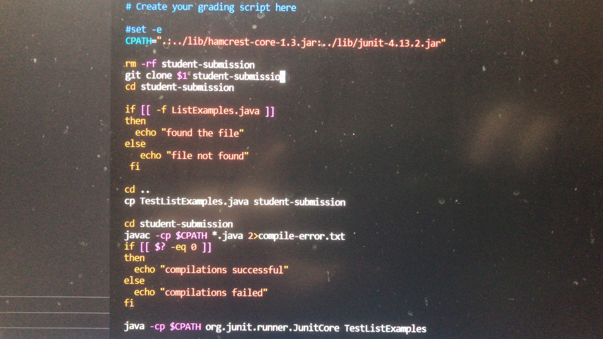
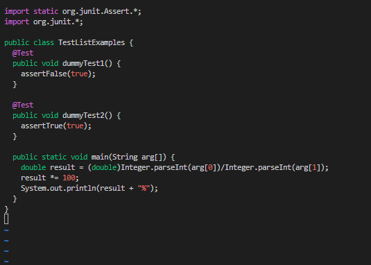
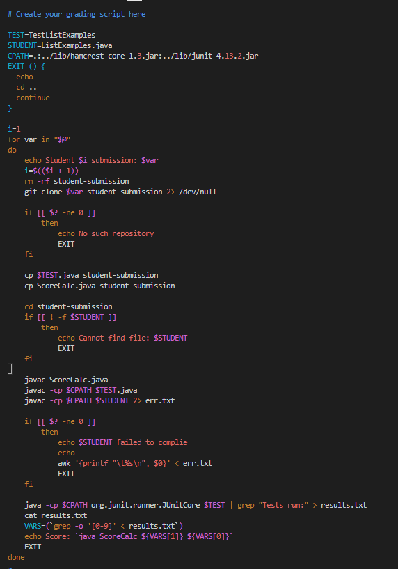
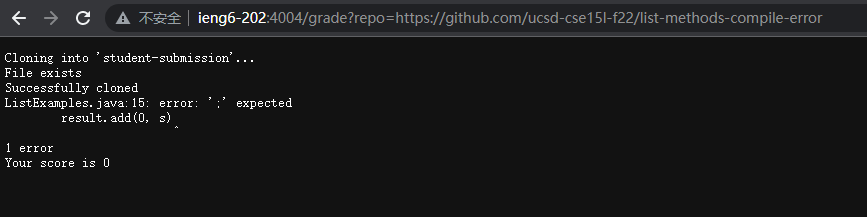
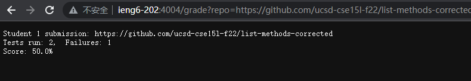
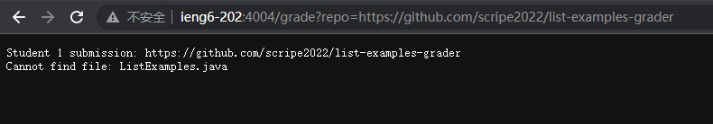
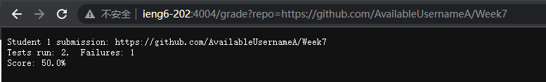
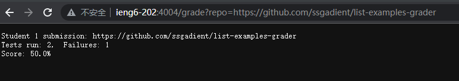

## Hi there！ It's Bruce
## Here is my Lab report for week 9/10:

# Vim My grade.sh

```
  We used if statement first to see if the tests files are in ther
  if it is currect, it will return 1, 0 otherwise
  we use echo command to print out the message
  or we choose to store the data in another file that we can access
  so that we dont have to deal with all the messes up error messages
```
# Here is what we did during the lab.



- We have already try to differentiate different situations and privde some useful feedbacks
- Though we did not add grading score 

and we add some dummy tests



- Here is how we can change our grade.sh files.



# Let's do some tests provided in Week 7 lab


here is what it comes with syntax error



here is what it should be almost current

# When I run other students' grade reports and their results on the server
- I used the google sheet to visit their github site and put their github.com/... web page information on the server
- such as https://localhost:4000/grade?repo=https://github.com... 
- However I am running on the server, so I will use ieng6 instead

- They look like these:







For the frist one it seems do not have such repository discription
This is because either is does not have a ListExamples.java file

For the second and third one
They both failed one test
