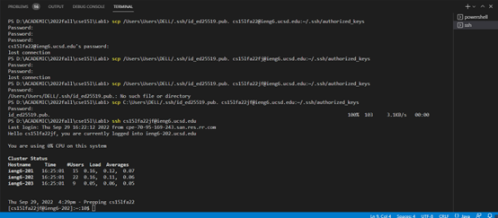

## Hi there！ It's Bruce
## Here is my Lab report for week 9/10:

# Vim My grade.sh

```
  Changing the name of the start parameter and its uses to base
```
# Here is what we did during the lab.


- We have already try to differentiate different situations and privde some useful feedbacks
- Though we did not add grading score 

and we add some dummy tests


- Here is how we can change our grade.sh files.


# Let's do some tests provided in Week 7 lab


here is what it comes with syntax error



here is what it should be almost current

# When I run other students' grade reports and their results on the server
- I used the google sheet to visit their github site and put their github.com/... web page information on the server
- such as https://localhost:4000/grade?repo=https://github.com... 
- However I am running on the server, so I will use ieng6 instead

- They look like these:


For the frist one it seems do not have such repository discription
This is because either is does not have a ListExamples.java file

For the second and third one
They both failed one test
